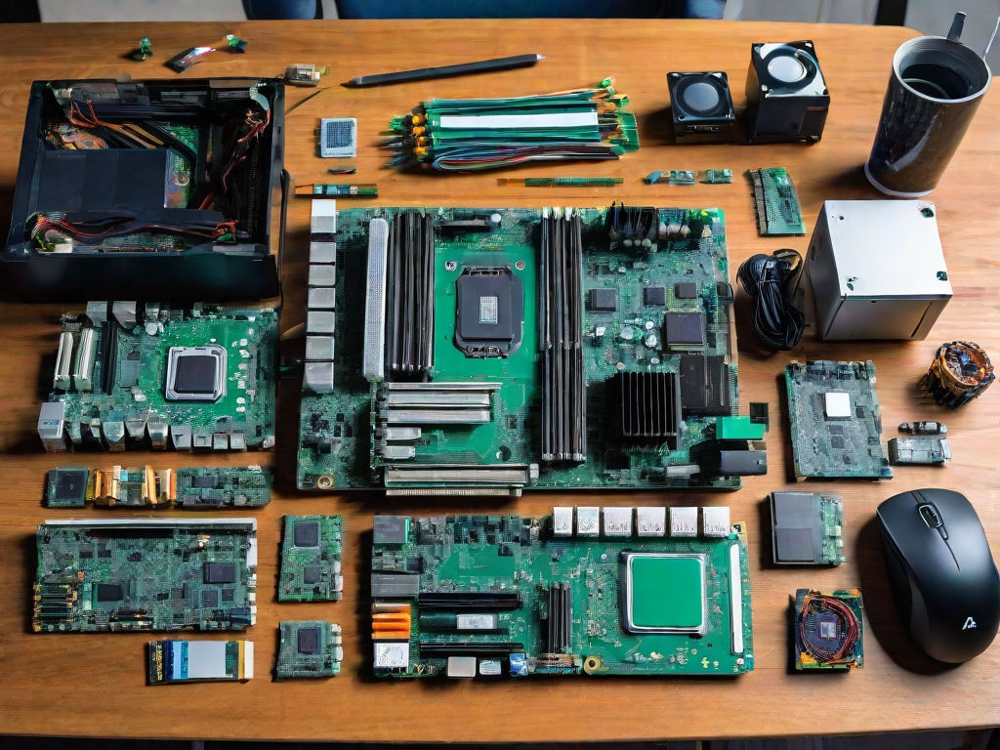
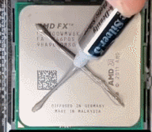

# Guía Definitiva para Armar un PC desde Cero (para Novatos)

Armar un PC desde cero es una tarea desafiante pero gratificante. Si está pensando en construir su propio sistema, hay algunas cosas que debe saber para asegurarse de que el proceso sea lo más fluido posible.

# Índice

1. [Compatibilidad de Componentes](#1-compatibilidad-de-componentes)
2. [Componentes Básicos para Dar Imagen](#2-componentes-básicos-para-dar-imagen)
3. [Recomendación para el Armado del PC](#3-recomendación-para-el-armado-del-pc)
4. [Elección de Componentes](#4-elección-de-componentes)
    - [Placa Base](#placa-base)
    - [Procesador](#procesador)
    - [Memorias RAM](#memorias-ram)
5. [Fuente de Alimentación](#5-fuente-de-alimentación)
    - [Elección de la Fuente](#elección-de-la-fuente)
    - [Cálculo de Watts](#cálculo-de-watts)
    - [Consejos Adicionales](#consejos-adicionales)
6. [Gabinete](#6-gabinete)
7. [Ensamblaje del PC](#7-ensamblaje-del-pc)
8. [Configuración y Sistema Operativo](#8-configuración-y-sistema-operativo)
9. [Consejos para el Ensamblaje](#9-consejos-para-el-ensamblaje)
    - [Área de Trabajo](#área-de-trabajo)
    - [Manipulación de Componentes](#manipulación-de-componentes)
    - [Cables y Conexiones](#cables-y-conexiones)
    - [Pruebas Preliminares](#pruebas-preliminares)
    - [BIOS y Configuración](#bios-y-configuración)
    - [Documentación](#documentación)
10. [Ventilación y Refrigeración](#10-ventilación-y-refrigeración)
    - [Refrigeración por Aire vs. Refrigeración Líquida](#refrigeración-por-aire-vs-refrigeración-líquida)
    - [Diseño del Gabinete](#diseño-del-gabinete)
    - [Ventiladores de Calidad](#ventiladores-de-calidad)
    - [Monitoreo de Temperatura](#monitoreo-de-temperatura-herramientas-de-diagnóstico)
11. [Contenido Relacionado](#contenido-relacionado)
12. [Aplicar pasta térmica al procesador](#Aplicar-pasta-térmica-al-procesador)
 
---

## 1. Compatibilidad de Componentes

La primera y más importante consideración es la compatibilidad. Puede utilizar sitios web para verificar la compatibilidad, como [PCPartPicker](https://pcpartpicker.com/list/).

---

## 2. Componentes Básicos para Dar Imagen

Esta sección destaca los componentes esenciales necesarios para que tu PC funcione correctamente y pueda proporcionar una imagen en el monitor. Cada uno de estos elementos desempeña un papel crucial en el rendimiento general del sistema:

- **Monitor (Obligatorio):** Necesario para dar imagen.
- **Placa Base (Obligatorio):** Conecta todos los componentes.
- **Procesador (Obligatorio):** Cerebro del sistema.
- **Memoria RAM (Obligatorio):** Almacena datos en uso.
- **Unidad de Almacenamiento (Opcional):** HDD o SSD para almacenar datos.
- **Tarjeta Gráfica (Opcional):** Genera la imagen en la pantalla.
- **Fuente de Alimentación (Obligatorio):** Suministra energía a todos los componentes.

---

## 3. Recomendación para el Armado del PC

1. **Placa Base:**
   Comienza eligiendo una placa base que se alinee con tus necesidades y expectativas. Este componente actúa como el núcleo, conectando todos los demás elementos esenciales del sistema.

2. **Procesador:**
   Después de seleccionar la placa base, elige un procesador compatible. Examina detenidamente las especificaciones para garantizar una armoniosa integración. Si no planeas instalar una tarjeta gráfica independiente, asegúrate de que el procesador tenga gráficos integrados para garantizar la salida de video.

3. **Memorias RAM:**
   Avanza con la elección de las memorias RAM. Asegúrate de que la capacidad y la velocidad sean apropiadas para tus tareas previstas, ya sea trabajo de oficina o sesiones intensas de juego.

4. **Tarjeta Gráfica:**
   Si tienes en mente una tarjeta gráfica independiente, selecciona una que sea armoniosa con tu placa base y que cumpla con tus exigencias de rendimiento, especialmente si eres un apasionado de los juegos o diseño gráfico.

5. **Fuente de Alimentación:**
   Antes de completar tu lista principal, escoge una fuente de alimentación con la potencia suficiente para todos tus componentes. Utiliza calculadoras online para estimar el consumo de energía y asegúrate de tener un margen del 80%.

6. **Compatibilidad General:**
   En cada etapa, verifica la compatibilidad general entre los componentes. Plataformas como [PCPartPicker](https://pcpartpicker.com/) facilitan este proceso y te ayudarán a evitar dolores de cabeza innecesarios.

---

## 4. Elección de Componentes

### Placa Base
- Buscar una placa base accesible a sus necesidades.
- Verificar la información detallada del componente.

### Procesador
- Buscar un procesador accesible a sus necesidades.
- Verificar la compatibilidad con la placa madre seleccionada.
- Utilizar [Bottleneck Calculator](https://pc-builds.com/es/bottleneck-calculator) para minimizar cuellos de botella.

### Memorias RAM
- Ofimática: Mínimo 8GB.
- Juegos: Mínimo 16GB.
- Verificar compatibilidad y configurar dual-channel si es posible.

---

## 5. Fuente de Alimentación

La fuente de alimentación es un componente crítico para asegurar un suministro de energía estable y eficiente. Aquí tienes algunos pasos clave a considerar:

### Elección de la Fuente

- **Certificación de Eficiencia:**
  Asegúrate de seleccionar una fuente de alimentación certificada en eficiencia. Las certificaciones comunes incluyen 80 PLUS, con niveles como Bronze, Silver, Gold, Platinum y Titanium. Se recomienda, como mínimo, una certificación Bronze para garantizar eficiencia adecuada.

- **Calculadora de Vatios:**
  Utiliza calculadoras de vatios en línea, como [Cooler Master PSU Calculator](https://www.coolermaster.com/power-supply-calculator/) o [Seasonic Wattage Calculator](https://seasonic.com/wattage-calculator). Ingresa la información detallada de tus componentes para determinar el consumo total de vatios estimado.

### Cálculo de Watts

- **Suma de Consumo:**
  Suma el consumo de vatios estimado de todos los componentes de tu sistema, incluyendo placa base, procesador, memoria RAM, tarjeta gráfica, unidades de almacenamiento, y otros dispositivos.

- **80% de Capacidad:**
  Asegúrate de que la capacidad de la fuente sea al menos el 80% del total calculado. Esto garantiza un suministro de energía adecuado y evita que la fuente opere constantemente al límite de su capacidad.

### Consejos Adicionales

- **Compatibilidad con el Gabinete:**
  Verifica que la fuente de alimentación sea compatible con el gabinete seleccionado. Revisa las dimensiones y la disposición de los cables para asegurarte de que encajen sin problemas.

- **Marcas Confiables:**
  Opta por marcas de fuente de alimentación confiables y bien revisadas por la comunidad. Lee reseñas y opiniones para tomar una decisión informada.

Recuerda que una fuente de alimentación adecuada es esencial para la estabilidad y durabilidad de tu sistema. Invertir en una fuente de calidad puede prevenir problemas futuros y garantizar un rendimiento óptimo.

---

## 6. Gabinete

- Buscar un gabinete compatible con los componentes.
- Verificar que todos los componentes entren correctamente.

---

## 7. Ensamblaje del PC

- Instalar todos los componentes en el gabinete.
- Conectar todos los cables.
- Iniciar el PC.

---

## 8. Configuración y Sistema Operativo

- Configurar la BIOS.
- Instalar el sistema operativo.
- Configurar el sistema según sus preferencias.

---

## 9. Consejos para el Ensamblaje

Al ensamblar tu PC, es crucial seguir algunos consejos para garantizar un montaje suave y un funcionamiento óptimo. Aquí tienes algunas recomendaciones:

### Área de Trabajo

- **Espacio Adecuado:**
  Asegúrate de tener suficiente espacio para organizar tus componentes y trabajar cómodamente. Una mesa limpia y bien iluminada facilitará el proceso.

- **Estatática:**
  Descarga la electricidad estática de tu cuerpo tocando una superficie metálica antes de tocar los componentes. Considera el uso de pulseras antiestáticas para mayor protección.

### Manipulación de Componentes

- **Manejo con Cuidado:**
  Manipula los componentes con cuidado. Evita tocar los pines y conectores siempre que sea posible. Sujeta las tarjetas y componentes por los bordes.

- **Posición Correcta:**
  Coloca la placa base sobre una superficie no conductora, como la caja de la placa base. Alinea los agujeros de montaje antes de asegurarla al gabinete.

- **Instalación de CPU:**
  Al instalar el procesador, verifica la orientación correcta. No fuerces la CPU; debe caer en su lugar sin resistencia.

### Cables y Conexiones

- **Gestión de Cables:**
  Organiza los cables para mejorar el flujo de aire y facilitar futuras actualizaciones. Usa bridas o sujetadores de cables para mantener todo ordenado.

- **Conexiones Adecuadas:**
  Asegúrate de conectar todos los cables correctamente. Consulta los manuales de la placa base y la fuente de alimentación para conocer la ubicación exacta de cada conexión.

### Pruebas Preliminares

- **Prueba Fuera del Gabinete:**
  Realiza una prueba preliminar antes de montar todos los componentes en el gabinete. Esto facilitará la identificación de posibles problemas.

- **Arranque Mínimo:**
  Inicia con lo esencial: placa base, CPU, RAM y fuente de alimentación. Agrega componentes adicionales después de confirmar que el sistema arranca correctamente.

### BIOS y Configuración

- **Actualización de BIOS:**
  Verifica si hay actualizaciones de BIOS para tu placa base antes de la instalación. La actualización puede mejorar la compatibilidad y el rendimiento.

- **Configuración de RAM:**
  Configura la frecuencia y temporizaciones de la RAM según las especificaciones del fabricante. Esto garantiza un rendimiento óptimo.

### Documentación

- **Manuales y Guías:**
  Consulta los manuales y guías de usuario de tus componentes. Proporcionan información específica sobre la instalación y configuración.

Siguiendo estos consejos, podrás ensamblar tu PC de manera eficiente y reducir el riesgo de problemas durante y después del proceso de montaje.

---

## 10. Ventilación y Refrigeración

La ventilación adecuada es esencial para mantener tu PC funcionando de manera óptima y evitar el sobrecalentamiento. Aquí hay algunas recomendaciones para la ventilación y refrigeración:

### Refrigeración por Aire vs. Refrigeración Líquida

- **Refrigeración por Aire:**
  La refrigeración por aire es una opción confiable y asequible. Los disipadores de calor y ventiladores de alta calidad pueden ofrecer un rendimiento excepcional. Asegúrate de que el disipador sea compatible con tu CPU y que quepa en tu gabinete.

- **Refrigeración Líquida:**
  Los sistemas de refrigeración líquida ofrecen una disipación de calor eficiente y son ideales para sistemas de gama alta. Los kits cerrados son fáciles de instalar, mientras que las soluciones personalizadas ofrecen un rendimiento excepcional, pero requieren más mantenimiento.

### Diseño del Gabinete

- **Ventilación Frontal:**
  Asegúrate de que el gabinete tenga ventilación frontal para permitir la entrada de aire fresco. Esto ayuda a mantener bajas las temperaturas internas.

- **Ventilación Trasera:**
  Un ventilador trasero permite la expulsión del aire caliente generado por los componentes internos. Verifica que el flujo de aire sea continuo y eficiente.

- **Ventilación Inferior:**
  Algunos gabinetes tienen ventilación en la parte inferior para tomar aire fresco desde el suelo. Si es posible, coloca el gabinete sobre una superficie elevada para mejorar la entrada de aire.

- **Ventilación Superior:**
  La ventilación superior permite la salida del aire caliente acumulado. Asegúrate de que haya espacio para ventiladores o radiadores en la parte superior del gabinete.

### Ventiladores de Calidad

- **Selección de Ventiladores:**
  Opta por ventiladores de alta calidad con buena capacidad de flujo de aire y baja sonoridad. Puedes buscar marcas conocidas como Noctua, Corsair, o NZXT.

- **Configuración Push-Pull:**
  Considera la configuración push-pull para radiadores de refrigeración líquida. Esto implica tener ventiladores tanto en la parte frontal como en la trasera del radiador para mejorar la eficiencia.

### Monitoreo de Temperatura [Herramientas de Diagnóstico](https://github.com/StarkTechRepo/Herramientas_de_Diagnostico)

- **Software de Monitoreo:**
  Utiliza software de monitoreo de temperatura para verificar las condiciones térmicas de tu sistema. Esto te permitirá ajustar la configuración de los ventiladores según sea necesario.

- **Perfiles de Ventilador:**
  Configura perfiles de ventilador en la BIOS para que los ventiladores respondan dinámicamente a las variaciones de temperatura, garantizando un equilibrio entre rendimiento y ruido.

La correcta ventilación y refrigeración aseguran la longevidad y estabilidad de tu PC, así que invierte en componentes de calidad para esta parte crucial de tu sistema.

---

# 11. Aplicar pasta térmica al procesador

La mejor manera de poner la pasta térmica al procesador es mediante el método de la cruz. Este método consiste en aplicar una pequeña cantidad de pasta térmica en forma de cruz en el centro del procesador. La presión ejercida por el disipador al montarlo, extenderá la pasta térmica uniformemente por toda la superficie del procesador.

## Tipos de Pastas Térmicas

1. **Basadas en Silicona:** Son económicas y fáciles de aplicar, pero tienden a secarse con el tiempo.

2. **Basadas en Óxido de Zinc:** Ofrecen un buen rendimiento y son más estables que las basadas en silicona.

3. **Compuestas de Metal:** Contienen partículas conductoras, como plata o cerámica, para mejorar la conductividad térmica. Son ideales para situaciones de alta exigencia.

4. **Compuestas de Metal Líquido:** Se aplican en forma líquida y luego se endurecen. Pueden proporcionar una cobertura más uniforme.

---

#  Licencia
Este procedimiento está bajo la [licencia Creative Commons Attribution 4.0 International](https://creativecommons.org/licenses/by/4.0/). Puedes compartir, adaptar y utilizar estos pasos siempre que des el crédito correspondiente al autor original.

# Nota importante
Se recomienda encarecidamente hacer una copia de seguridad de los datos importantes antes de continuar. El autor no se hace responsable de ningún daño o problema causado por el mal uso de estas tecnicas.
